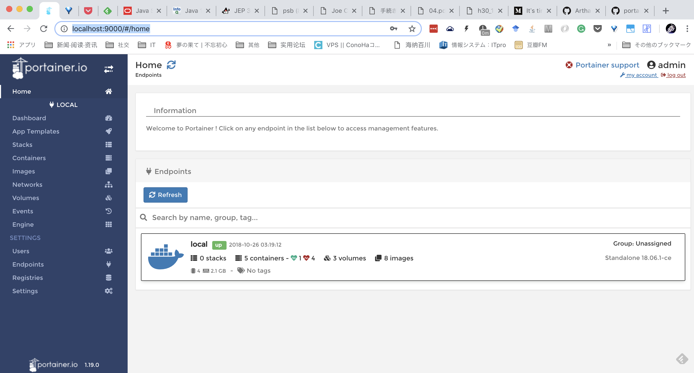
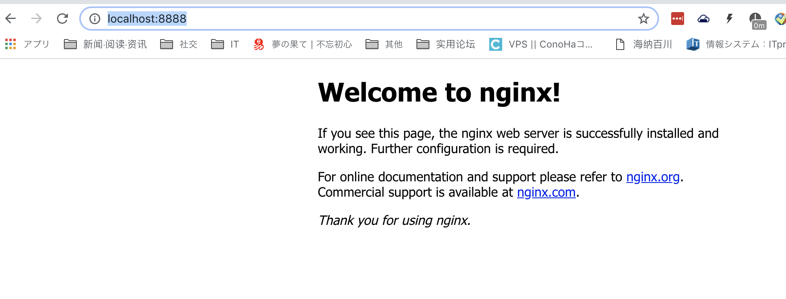

# Docker を使いながら学ぶ

## 目的

- 実際例を行うことで、Docker の基礎を勉強する
- Docker を利用して開発することができる

## 前提

- Mac で Docker がインストールされている
  > していない場合は[ここ](https://docs.docker.com/docker-for-mac/install/)
- すでに「コンテナー仮想化」知識を獲得した
- GUI ではなく、CLI で docker を操作したい
  > とはいえ、GUI と CLI 両方活用して勉強するのは一番賢い
- すでに `image` 、 `repository` 、 `container` をの指していることを理解している

## 使える記事

- [いまさら Docker に入門したので分かりやすくまとめます](https://qiita.com/gold-kou/items/44860fbda1a34a001fc1)
- [Docker でプログラマは最低限知るべきことが、最速でわかるチュートリアル](https://qiita.com/woz/items/43462398765f8036f3a8)
- [なぜ Docker ではホスト OS と違う OS ベースのコンテナイメージが動くのか](https://qiita.com/kirikunix/items/33414240b4cacee362da)

## 課題１

### 課題１で達成したい目標

- とりあえず docker を触る
- CLIでdockerコンテナーを起動する
- GUIでdockerコンテナーを起動する

### 1-1 hello-world

#### お題： `docker run hello-world` を実行する

#### 合格基準： 下記のメッセージが出力される

```bash
Hello from Docker!
This message shows that your installation appears to be working correctly.

To generate this message, Docker took the following steps:
 1. The Docker client contacted the Docker daemon.
 2. The Docker daemon pulled the "hello-world" image from the Docker Hub.
    (amd64)
 3. The Docker daemon created a new container from that image which runs the
    executable that produces the output you are currently reading.
 4. The Docker daemon streamed that output to the Docker client, which sent it
    to your terminal.

To try something more ambitious, you can run an Ubuntu container with:
 $ docker run -it ubuntu bash

Share images, automate workflows, and more with a free Docker ID:
 https://hub.docker.com/

For more examples and ideas, visit:
 https://docs.docker.com/get-started/
```

#### 参考までに

- 英語だけど、この helloworld のメッセージを読む価値あり

### 1-2 GUI ツールを導入する

#### お題：[portainer](https://github.com/portainer/portainer)を導入する

GitHub に手順が書かれているため、導入してみてください

#### 合格基準： http://localhost:9000/#/home へアクセスすると、下記っぽい画面が出てくる



### 1-3 nginxコンテナーを動かしてみる

#### お題：CLIでnginxコンテナーを起動する

#### 合格基準：http://localhost:8888/ へアクセスすると、下記っぽい画面が出てくる



#### 個人メモ

- １つコマンドで目標を達成できる

### 1-4 GUIでやり直す

#### お題：GUIでnginxコンテナーを起動する

#### 合格基準：1-3と同じ

#### 参考までに

Portanterについては[この記事](https://qiita.com/ao_log/items/d8ef847c826746f9e84b) を参照してください。

