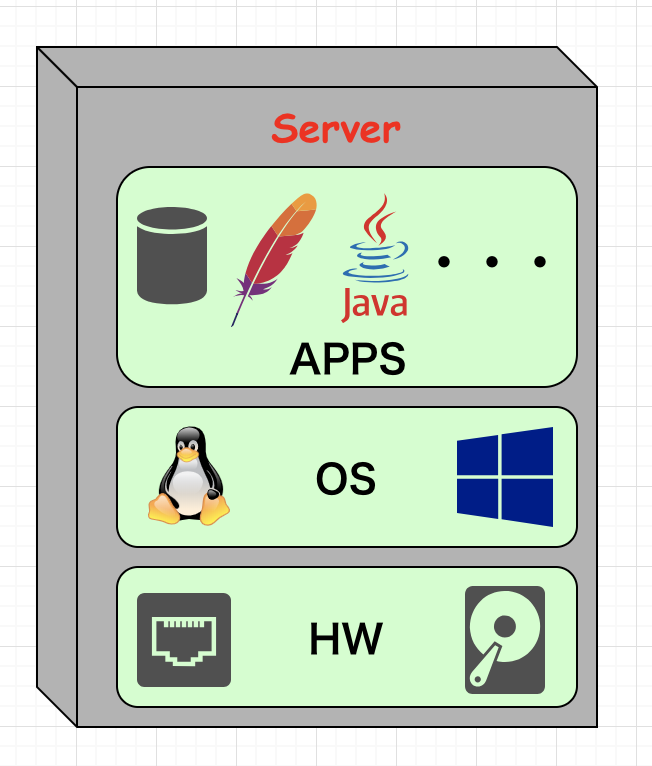
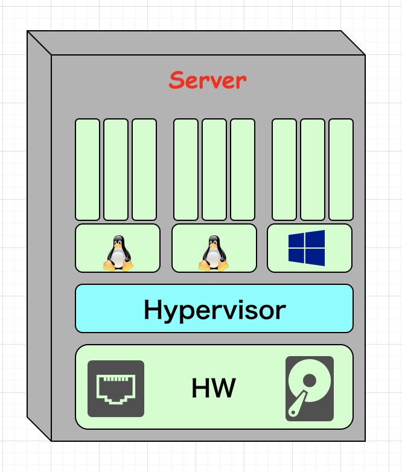

<!-- $theme: gaia -->
<!-- page_number: true -->

## A Brief Introduction about Docker
#### Zhang Nan a.k.a snOw_dAy
#### 2018-11-10

----
# Agenda
- Why docker?
- What is docker?
- Image, Container and Repository
- Build, Ship, Run
- (Optional) kubernetes
- (Optional) Container Virtualization
----
# Agenda
- <u>**Why docker?**</u>
- What is docker?
- Image, Container and Repository
- Build, Ship, Run
- (Optional) kubernetes
- (Optional) Container Virtualization
----
### 地は混沌であって、闇が深淵の面にあり

（聖書：創世記１：２）

----
## Before

----
## 現代のCPUは、どのような性能を持つか？

----
## 現代のCPUは、どのような性能を持つか？
### 毎秒799.2億回計算

----
## サーバーのCPU使用率の平均値は？

----
## サーバーのCPU使用率の平均値は？
### 20% ~ 30%

----
## サーバーのCPU使用率の平均値は？
### 20% ~ 30%
## ↑リソースの無駄使いじゃん↑

----
## 神の霊が水の面を動いていた

（聖書：創世記１：２）

----

## 仮想化

----

## After

----
## OS間での<u>リソース共有</u>
## 計算資源の<u>効率利用</u>

----
## いいね！(*^o^*)

----
### 神は言われた。「光あれ。」
### こうして、光があった

（聖書：創世記１：３）

----

## 仮想化

----
# dockerとは？
- ここで一般的な定義を書く

----

# わかりづらいでしょう？

----

# 仮想化なんて知らない
## （知りたくもない）

----

